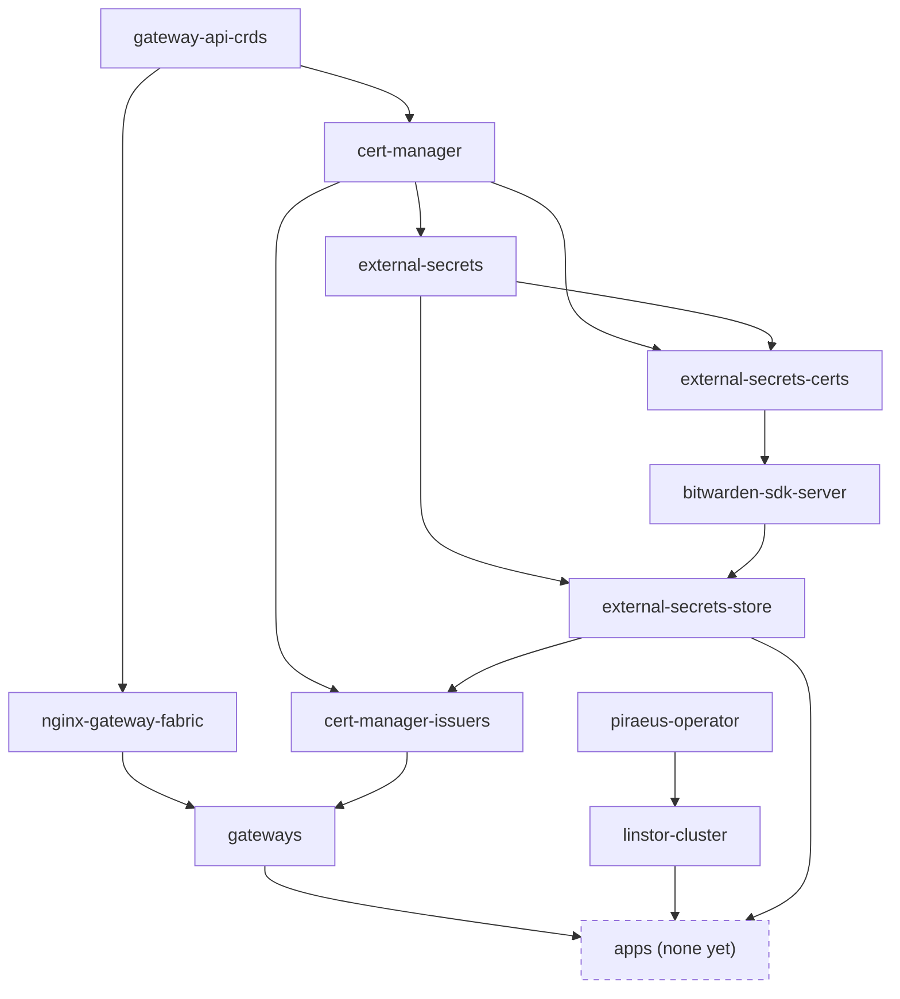
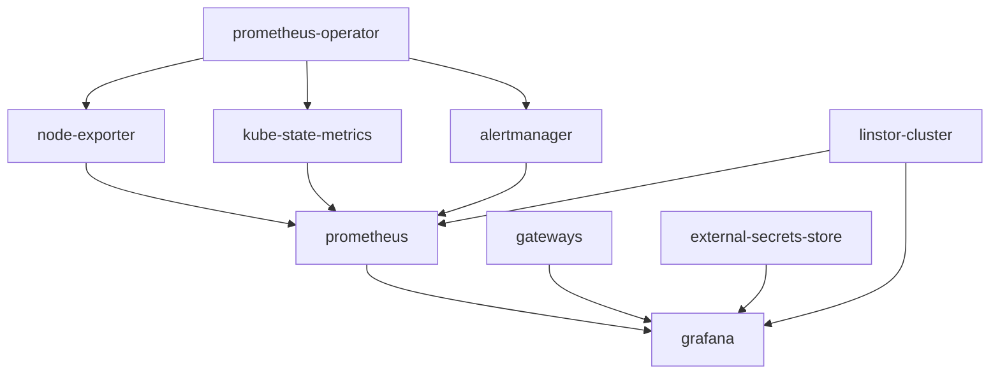

# k8s-flux

GitOps configuration for the homelab Kubernetes cluster(s), reconciled by
[Flux](https://fluxcd.io).

## Repository Layout

```
clusters/          One directory per physical or virtual cluster, with one subdirectory per environment.
apps/              Application workloads
infrastructure/    Cluster infrastructure: one directory per deployable unit.
```

### `clusters/<cluster>/<env>/`

The entry point for Flux. Each `<cluster>/<env>` pair is bootstrapped independently
(`flux bootstrap --path=clusters/<cluster>/<env>`) and contains its own `flux-system/`
directory, which is generated by `flux bootstrap` and must not be edited by hand.
Two files complete the setup:

- `infrastructure.yaml` — one Flux `Kustomization` per infrastructure unit.
- `apps.yaml` — the Flux `Kustomization`(s) for workloads (absent while there are none).

These files are the dependency graph. Flux's `dependsOn` only links whole Flux
Kustomizations, so every unit that something else must wait for gets its own
Kustomization with `wait: true` (Ready means its HelmReleases and resources are Ready),
and lists what it needs in `dependsOn`.

### `infrastructure/<cluster>/<unit>/` and `apps/<cluster>/...`

Each unit is one node in the graph and follows a standard Kustomize layout: `base/` holds
the canonical manifests. An environment directory (`development/`, `production/`) exists
only when that environment diverges (e.g. `linstor-cluster`, which needs different disks);
otherwise both environments point their Kustomization at `base/`.

`bee` infrastructure units, and what each waits for:



`external-secrets-certs` also depends on `cert-manager` directly (it needs the Issuer and
Certificate CRDs). `cert-manager-issuers` holds the `letsencrypt` ClusterIssuer (DNS-01 via
Cloudflare) and the `cloudflare-api-token` ExternalSecret it reads, so it needs both
`cert-manager` and `external-secrets-store`. `gateways` holds the single shared `bee-gateway` (wildcard TLS via the
`letsencrypt` issuer, HTTP redirected to HTTPS) and waits for both `nginx-gateway-fabric` and `cert-manager-issuers`.
Every service is exposed through it on a subdomain. There is no LoadBalancer controller:
nginx-gateway-fabric runs its data plane as a DaemonSet with `hostPort` 80/443 on every node, so
the kube-vip API VIP answers on 80/443 (gateway) as well as 6443 (API), whichever node holds it. `gateway-api-crds` is defined directly in `infrastructure.yaml`
because its source is the upstream Gateway API repository.

There are no `bee` apps yet. Each app goes in `apps/<cluster>/<app>/base` with its own
Kustomization in `clusters/<cluster>/<env>/apps.yaml`, whose `dependsOn` lists only what that
app uses (`gateways` for anything with an HTTPRoute, plus `linstor-cluster` for PVCs,
`external-secrets-store` for ExternalSecrets). Attach HTTPRoutes to the `xtinto.com-https`
listener of `bee-gateway`.

To add a unit: create `infrastructure/<cluster>/<unit>/base/`, then add a Kustomization
for it in each environment's `infrastructure.yaml` with `dependsOn` on whatever it needs
(CRDs, namespaces, Secrets, storage classes). Use HelmRelease `dependsOn` only for ordering
inside a single unit.

`external-secrets-store` becomes Ready only once the `bitwarden-access-token` Secret exists
in the `external-secrets` namespace. Creating it is a manual bootstrap step, and everything
that depends on the store (apps) waits until it is there.

### Monitoring

Prometheus and Grafana are split into separate units rather than one umbrella release:

- `prometheus-operator` installs the Prometheus Operator and its CRDs. prometheus-community has no
  maintained standalone operator chart (the `prometheus-operator` chart is deprecated), so the
  `kube-prometheus-stack` chart is used with every bundled component disabled. It also ships the
  Kubernetes control-plane `ServiceMonitor`s (kubelet/cAdvisor, kube-apiserver, CoreDNS), which
  authenticate with the `prometheus-token` Secret created by the `prometheus` unit.
- `node-exporter` (per-node CPU, memory, filesystem, network), `kube-state-metrics` (object and
  workload state) and `alertmanager` each deploy a single component.
- `prometheus` runs the Prometheus instance (15d retention on the `replicated` storage class), the
  `ServiceAccount`/token it scrapes with, and a set of `PrometheusRule`s. Its selectors are empty, so
  every `ServiceMonitor`/`PodMonitor`/`PrometheusRule` in every namespace is picked up.
- `grafana` runs Grafana, exposed at `grafana.xtinto.com` through `bee-gateway`. Admin credentials
  are generated once by the `grafana-passphrase` Job using the Bitwarden CLI
  (`bw generate -p --words 3 --separator "." --includeNumber -c`), pushed to Bitwarden with
  `PushSecret` (`updatePolicy: IfNotExists`) and pulled back by an `ExternalSecret`; an existing
  Bitwarden value is never overwritten, so the password survives a cluster rebuild.



To monitor an application, add a `ServiceMonitor` (or `PodMonitor`) next to its workload in
`apps/<cluster>/<app>/base`, selecting its Service or pods. No labels are required — the Prometheus
instance selects all of them. Apps without native Prometheus metrics still get pod/deployment state
from kube-state-metrics and per-container CPU/memory from kubelet/cAdvisor.

### Clusters

- **bee** — the active cluster, currently being rebuilt from scratch.
- **oldbee** — the previous `bee` setup. It is archived and no longer reconciled by
  Flux; it is retained for reference and for recovering manifests if needed.

## Secrets

No plaintext secrets are stored in this repository. All secrets are managed through
[external-secrets](https://external-secrets.io), which pulls from Bitwarden Secrets
Manager (`ClusterSecretStore: bitwarden-secrets-manager`) via `ExternalSecret` and
`PushSecret` resources. Any credential found committed in this repository should be
treated as compromised: remove it and rotate it immediately.
