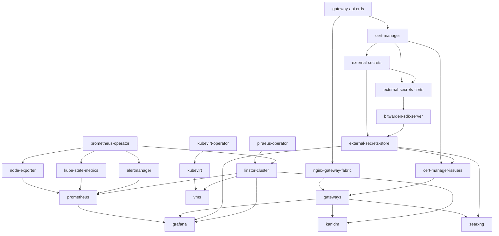

# k8s-flux

GitOps configuration for the homelab Kubernetes cluster(s), reconciled by
[Flux](https://fluxcd.io).

## Repository layout

```
clusters/          One directory per cluster, one subdirectory per environment (Flux entrypoint).
apps/              Application workloads.
vms/               KubeVirt virtual machines.
infrastructure/    Cluster infrastructure, one directory per deployable unit.
```

Each unit is a Kustomize `base/`; an env directory (`development/`, `production/`) exists only
when that environment diverges. `clusters/<cluster>/<env>/` is bootstrapped with
`flux bootstrap --path=clusters/<cluster>/<env>` and contains the generated `flux-system/`
(do not edit). `infrastructure.yaml`, `apps.yaml` and `vms.yaml` hold one Flux `Kustomization`
per unit; `dependsOn` (with `wait: true`) is the dependency graph.

## Clusters

- **bee** — active cluster.
- **oldbee** — archived, no longer reconciled; kept for reference.

## bee

Dependencies between units:



### Infrastructure

- `gateway-api-crds` — upstream Gateway API CRDs.
- `cert-manager` — cert-manager.
- `external-secrets`, `external-secrets-certs` — external-secrets operator and its certificates.
- `bitwarden-sdk-server` — Bitwarden Secrets Manager SDK server.
- `external-secrets-store` — `ClusterSecretStore` backed by Bitwarden.
- `cert-manager-issuers` — `letsencrypt` ClusterIssuer (DNS-01 via Cloudflare).
- `nginx-gateway-fabric` — Gateway API data plane (hostPort 80/443 on every node).
- `gateways` — shared `bee-gateway` for `*.xtinto.com`, HTTP redirected to HTTPS.
- `piraeus-operator`, `linstor-cluster` — LINSTOR storage (`local`, `replicated`).
- `prometheus-operator`, `node-exporter`, `kube-state-metrics`, `alertmanager`, `prometheus`,
  `grafana` — monitoring.
- `kubevirt-operator`, `kubevirt` — virtualization.

### Apps

- `searxng` — `searxng.xtinto.com`; depends on `gateways`, `external-secrets-store`.
- `kanidm` — `idm.xtinto.com`; depends on `gateways`, `linstor-cluster`.

### VMs

A VM lives in `vms/<cluster>/<vm>/base` with its own Kustomization in `vms.yaml`, depending on
`kubevirt` and `linstor-cluster` (plus `external-secrets-store` when cloud-init data comes from
an `ExternalSecret`).

## Secrets

No plaintext secrets. All secrets go through external-secrets backed by Bitwarden
(`ClusterSecretStore: bitwarden-secrets-manager`). Anything committed here is compromised:
remove and rotate it. `external-secrets-store` becomes Ready only after the
`bitwarden-access-token` Secret exists in `external-secrets` (a manual bootstrap step).
